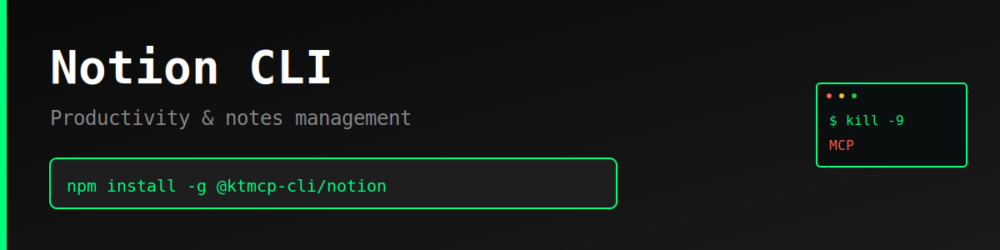

> "Six months ago, everyone was talking about MCPs. And I was like, screw MCPs. Every MCP would be better as a CLI."
>
> — [Peter Steinberger](https://twitter.com/steipete), Founder of OpenClaw
> [Watch on YouTube (~2:39:00)](https://www.youtube.com/@lexfridman) | [Lex Fridman Podcast #491](https://lexfridman.com/peter-steinberger/)

# Notion CLI

Production-ready command-line interface for the [Notion API](https://developers.notion.com/) - Productivity and notes management.

> **⚠️ Unofficial CLI** - This tool is not officially sponsored, endorsed, or maintained by Notion. It is an independent project built on the public Notion API. API documentation: https://developers.notion.com/

## Features

- Complete coverage of Notion API endpoints for pages, databases, blocks, and search
- Simple, intuitive command structure
- JSON and pretty-print output formats
- Persistent configuration storage
- Progress indicators for long-running operations

## Why CLI > MCP

### The MCP Problem

Model Context Protocol (MCP) servers introduce unnecessary complexity and failure points for API access:

1. **Extra Infrastructure Layer**: MCP requires running a separate server process
2. **Cognitive Overhead**: Agents must learn MCP-specific schemas on top of API semantics
3. **Debugging Nightmare**: Three layers (AI → MCP → API) instead of two (AI → API)
4. **Limited Flexibility**: MCP servers implement subsets of API features
5. **Maintenance Burden**: Every API change requires updating MCP server and docs

### The CLI Advantage

1. **Zero Runtime Dependencies**: No server process to manage
2. **Direct API Access**: One hop from agent to API
3. **Human + AI Usable**: Same tool works for developers and agents
4. **Self-Documenting**: Built-in `--help` text
5. **Composable**: Standard I/O piping and scripting
6. **Better Errors**: Direct API error messages
7. **Instant Debugging**: `--json` flag for exact API responses

## Installation

```bash
npm install -g @ktmcp-cli/notion
```

Or install locally:

```bash
cd notion
npm install
npm link
```

## Configuration

### Set API Token

Get your API token from https://www.notion.so/my-integrations

```bash
notion config set apiToken YOUR_TOKEN_HERE
```

### Environment Variables

Alternatively, use environment variables:

```bash
export NOTION_API_TOKEN=your_token_here
export NOTION_BASE_URL=https://api.notion.com/v1  # Optional
```

### View Configuration

```bash
# Show all config
notion config list

# Get specific value
notion config get apiToken
```

## Usage

### Pages

```bash
# Get page details
notion pages get <page-id>

# Create page
notion pages create --parent-id <parent-id> --title "Meeting Notes"

# Update page
notion pages update <page-id> --title "New Title"

# Archive page
notion pages archive <page-id>
```

### Databases

```bash
# Get database details
notion databases get <database-id>

# Query database
notion databases query <database-id>

# Query with filter
notion databases query <database-id> --filter '{"property":"Status","select":{"equals":"Done"}}'

# Create database
notion databases create --parent-id <page-id> --title "Tasks"
```

### Blocks

```bash
# Get block details
notion blocks get <block-id>

# Get block children
notion blocks children <block-id>

# Append content
notion blocks append <block-id> --text "New paragraph content"

# Delete block
notion blocks delete <block-id>
```

### Search

```bash
# Search workspace
notion search "meeting notes"

# Search for pages only
notion search "project" --type page

# Search for databases only
notion search --type database
```

## JSON Output

All commands support `--json` flag for machine-readable output:

```bash
notion pages get <page-id> --json
notion databases query <database-id> --json
notion search "notes" --json
```

## Examples

### AI Agent Use Case

```bash
# Search and extract page IDs
PAGES=$(notion search "standup" --json)
PAGE_ID=$(echo $PAGES | jq -r '.results[0].id')

# Get page content
notion pages get $PAGE_ID --json

# Create new page
notion pages create --parent-id <parent-id> --title "Daily Standup $(date +%Y-%m-%d)" --json
```

### Automation Scripts

```bash
#!/bin/bash
# Query database and process results
DATABASE_ID="your-database-id"
notion databases query $DATABASE_ID --json | \
  jq '.results[] | select(.properties.Status.select.name == "In Progress")'
```

## Error Handling

The CLI provides clear error messages:

```bash
$ notion pages list
Error: API token not configured. Run: notion config set apiToken YOUR_TOKEN

$ notion pages get invalid_id
Error: Notion API Error: 404 - Page not found
```

## Development

```bash
# Clone the repository
git clone https://github.com/ktmcp-cli/notion.git
cd notion

# Install dependencies
npm install

# Run locally
node bin/notion.js --help

# Test commands
node bin/notion.js config set apiToken test_token
node bin/notion.js search "test"
```

## License

MIT License - see LICENSE file for details.

## Links

- **Website**: https://killthemcp.com/notion-cli
- **GitHub**: https://github.com/ktmcp-cli/notion
- **npm**: https://www.npmjs.com/package/@ktmcp-cli/notion
- **Notion API Docs**: https://developers.notion.com/
